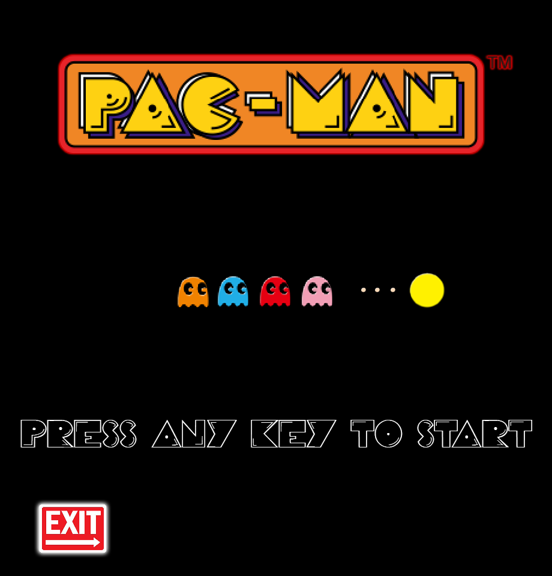

<h1 align="center"> Pacman </h1>
 

  

  
  
  

>## Project:
Development of the famous game **Pacman** in the second year of my Computer Science degree at the F.S.T Limoges (France) with Yoann SOCHAJ.

>## Technology used:
Processing: https://processing.org/

>## Authors:
- Matt TAYLOR
- Yoann SOCHAJ [(GitHub profile)](https://github.com/YoannSo)

>## Final version:
**Sochaj_Taylor**

>## Useful Links:
>#### Project report: [PacMan.pdf](PacMan.pdf)
